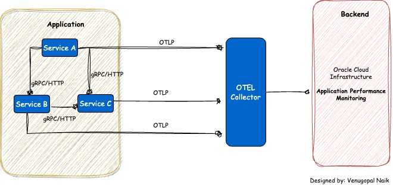
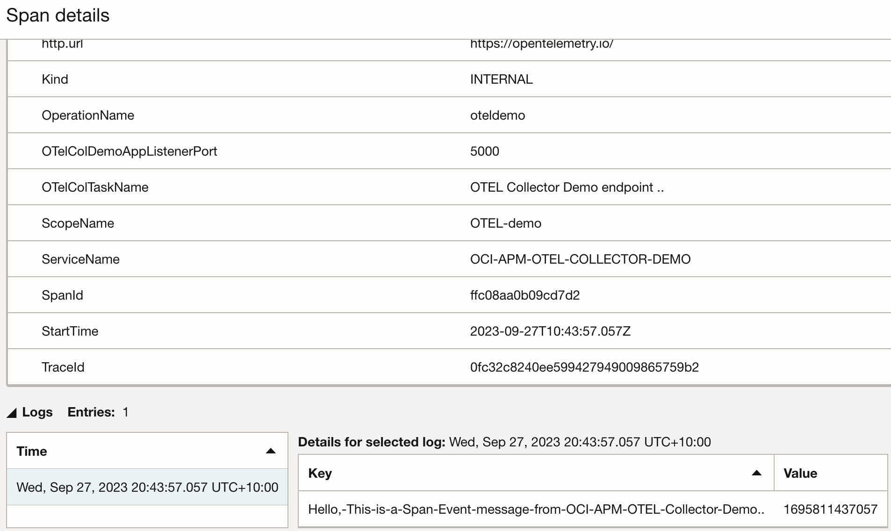

# Opentelemetry instrumentation with Oracle Cloud Infrastructure APM (using OTel Collector)

In this example we will cover the OTEL instrumentation with Otel collector and OCI APM.

Refer [SingleSpanExample](../README.md) before starting on this use case.


# Architecture



# Steps

 [Clone](https://github.dev/naikvenu/oracle-opentelemetry) this repository.
 
 ```
 $ cd OTelCollectorExample
 ```

 # Build and push the Image to Oracle OCIR Registry

 Example:

 ```
 $ docker login syd.ocir.io
 $ docker build -f Dockerfile -t syd.ocir.io/<tenancy-name>/<repo-name>/oci-otel . 
 $ docker push syd.ocir.io/<tenancy-name>/<repo-name>/oci-otel
 ```

# Deploy the App

Steps to configuring Kubernetes are omitted from this documentation.

Create a namespace called demo.

```
kubectl create ns demo
kubectl -n demo create secret docker-registry ocirsecret --docker-server=syd.ocir.io --docker-username=<tenancy>/oracleidentitycloudservice/<username> --docker-password='<token>'

```

otel-apm-dep.yml:

```yaml
apiVersion: apps/v1
kind: Deployment
metadata:
  name: otel-apm-demoapp
  labels:
    app: otel-apm-demoapp
spec:
  replicas: 1
  selector:
    matchLabels:
      app: otel-apm-demoapp
  template:
    metadata:
      labels:
        app: otel-apm-demoapp
    spec:
      containers:
      - name: otel-apm-demoapp
        image: syd.ocir.io/<tenancy-name>/<repo>/oci-otel:latest
        imagePullPolicy: Always
        ports:
        - containerPort: 5000
      imagePullSecrets:
      - name: ocirsecret

```

Apply:

```
kubectl -n demo create -f otel-apm-dep.yml
```

# Deploy the Collector

```
kubectl -n demo create -f otel-collector.yaml
```

# Proxy Forward the App

```
kubectl -n demo get pods
kubectl -n demo get pod otel-apm-demoapp-864d76db4c-d4thh --template='{{(index (index .spec.containers 0).ports 0).containerPort}}{{"\n"}}'
kubectl port-forward pods/otel-apm-demoapp-864d76db4c-d4thh 5000:5000

```

# Access the Application

           http://localhost:5000

# Verify the traces on OCI APM




<br>
<br>
---
<br>
<b>** Disclaimer</b>:  I work for Oracle and the views expressed on this documentation are my own and do not necessarily reflect the views of Oracle. **
