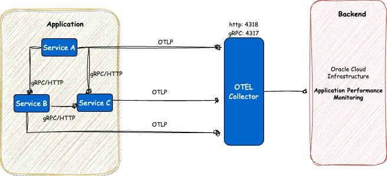

# Opentelemetry instrumentation with Oracle Cloud Infrastructure APM (using OTel Collector)

In this example we will cover the OTEL instrumentation with Otel collector and OCI APM.

The OpenTelemetry Collector is a vendor-agnostic proxy that can receive, process, and export telemetry data. It supports receiving telemetry data in multiple formats (for example, OTLP, Jaeger, Prometheus, as well as many commercial/proprietary tools) and sending data to one or more backends. It also supports processing and filtering telemetry data before it gets exported.

Read more https://opentelemetry.io/docs/collector/

We did explore [SingleSpanExample](../README.md) example to get started with OpenTelemetry, sending your data directly to a backend is a great way to get value quickly. Also, in a development or small-scale environment you can get decent results without a collector.

However, in general its recommended using a collector alongside your service, since it allows your service to offload data quickly and the collector can take care of additional handling like retries, batching, encryption or even sensitive data filtering.

The Collector consists of four components that access telemetry data:

    Receivers
    Processors
    Exporters
    Connectors 

These components once configured must be enabled via pipelines within the service section.


# Architecture



# Steps

 [Clone](https://github.dev/naikvenu/oracle-opentelemetry) this repository.
 
 ```
 $ cd OTelCollectorExample
 ```

 # Build and push the Instrumented Application Image to Oracle OCIR Registry

 Example:

 ```
 $ docker login syd.ocir.io
 $ docker build -f Dockerfile -t syd.ocir.io/<tenancy-name>/<repo-name>/oci-otel . 
 $ docker push syd.ocir.io/<tenancy-name>/<repo-name>/oci-otel
 ```

# Deploy the App

We'll be using Kubernetes to work with this example. Steps to configure Kubernetes is omitted from this documentation.

- Create a namespace called demo.

```
$ kubectl create ns demo

$ kubectl -n demo create secret docker-registry ocirsecret --docker-server=syd.ocir.io --docker-username=<tenancy>/oracleidentitycloudservice/<username> --docker-password='<token>'

```

- Create a file named otel-apm-dep.yml:

```yaml
apiVersion: apps/v1
kind: Deployment
metadata:
  name: otel-apm-demoapp
  labels:
    app: otel-apm-demoapp
spec:
  replicas: 1
  selector:
    matchLabels:
      app: otel-apm-demoapp
  template:
    metadata:
      labels:
        app: otel-apm-demoapp
    spec:
      containers:
      - name: otel-apm-demoapp
        image: syd.ocir.io/<tenancy-name>/<repo>/oci-otel:latest
        imagePullPolicy: Always
        ports:
        - containerPort: 5000
      imagePullSecrets:
      - name: ocirsecret

```

Apply:

```
kubectl -n demo create -f otel-apm-dep.yml
```

# Deploying the Collector

Add the <APM_ENDPOINT> and <DATA_KEY> before running the below command.
```
kubectl -n demo create -f kubernetes/otel-collector.yaml
```

# Proxy Forward the Application Pod

```
kubectl -n demo get pods
kubectl -n demo get pod otel-apm-demoapp-864d76db4c-d4thh --template='{{(index (index .spec.containers 0).ports 0).containerPort}}{{"\n"}}'
kubectl port-forward pods/otel-apm-demoapp-864d76db4c-d4thh 5000:5000

```

# Access the Application

           http://localhost:5000

# Verify the traces on OCI APM


<br>
<br>
---
<br>
<b>** Disclaimer</b>:  I work for Oracle and the views expressed on this documentation are my own and do not necessarily reflect the views of Oracle. **
