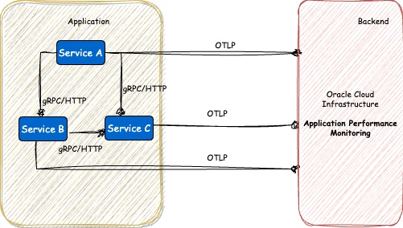
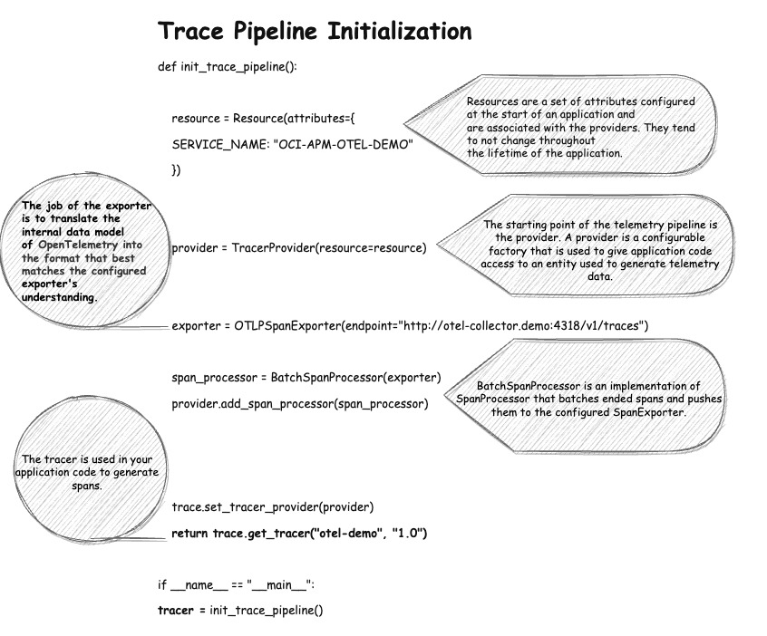
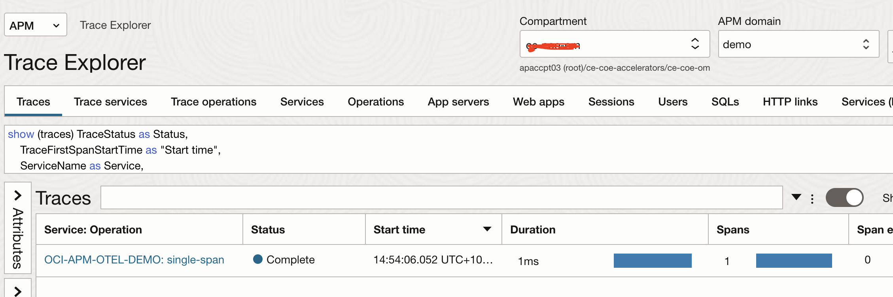
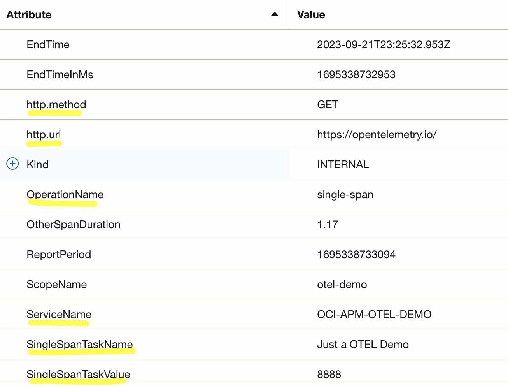
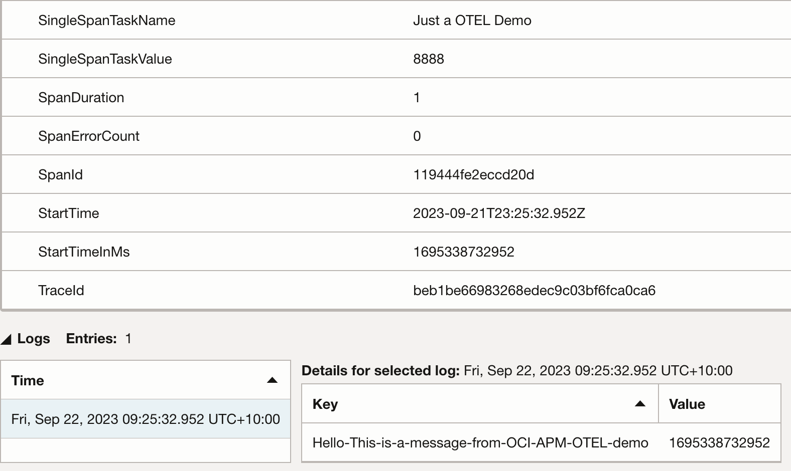
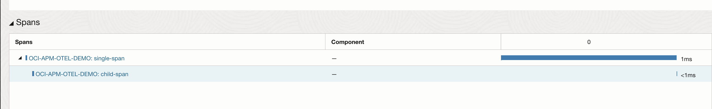

# Opentelemetry instrumentation with Oracle Cloud Infrastructure APM

In this doc, lets discuss Opentelemetry manual instrumentation process using Opentelemetry SDK's . 
We will use OCI APM as a back-end to analyze these traces.

Lets also learn some basics as we go:

	- The trace pipeline and initialization
	- How to configure resource and span attributes
	- Adding Span events 
	- Use of semantic conventions
    - Exploring traces on OCI APM 


<h1>Architecture</h1> 



We will be implementing the above use case. As you can see in this architecture all these application services are communicating with each other via Http or gRPC protocol and each of these services are configured to send the traces directly to OCI APM. Do note that the services send traces to APM via OTLP protocol.

OTLP is a general-purpose telemetry data delivery protocol, it defines the encoding of telemetry data and the protocol used to exchange data between the client and the server. This specification defines how OTLP is implemented over gRPC and HTTP 1.1 transports and specifies Protocol Buffers schema that is used for the payloads. OTLP is a request/response style protocol: the clients send requests, and the server replies with corresponding responses.


# Trace Pipeline



# Configuring APM Back-end

The above explanation highlights the details of the exporter when OTEL collector is used. If we are using APM as back-end then you would need to initialize the OTLPSpanExporter as shown below:
```
exporter = OTLPSpanExporter(endpoint="https://<apm-data-upload-endpoint>.com/20200101/opentelemetry/public/v1/traces",
                          headers={"authorization": "dataKey <apm-domain-data-key>"})

```

Do refer to [this](https://docs.oracle.com/en-us/iaas/application-performance-monitoring/doc/configure-open-source-tracing-systems.html#APMGN-GUID-4D941163-F357-4839-8B06-688876D4C61F) documentation for the details on this.


# Adding Span Attributes:

- Firstly, i have used a decorator which simplifies the span creation and completion. It handles the context propogation (we shall discuss in later) and also the code looks neat !
- We need to get the current span to be able to set span attributes and events as show below. 
- We import the semantic convention package and use the constants defined like HTTP_METHOD and HTTP_URL.

```python
@tracer.start_as_current_span("single-span")
def single_span():
  print("doing some work at this span...")
  current_span = trace.get_current_span()
  
  # Setting Span Attributes
  current_span.set_attribute("SingleSpanTaskValue", 8888)
  current_span.set_attribute("SingleSpanTaskName", "Just a OTEL Demo")
  
  # Adding a Event
  current_span.add_event("Hello This is a message from OCI APM OTEL demo")

  #Using Semantic Conventions
  from opentelemetry.semconv.trace import SpanAttributes
  current_span.set_attribute(SpanAttributes.HTTP_METHOD, "GET")
  current_span.set_attribute(SpanAttributes.HTTP_URL, "https://opentelemetry.io/") 
  ```

** How to run:

[Clone](https://github.com/naikvenu/oracle-opentelemetry/tree/main/singleSpanExample) this repository

Create a virtual env if required.

```python
$ cd SingleSpanExample
$ python otel-app.py
  doing some work at this span...
```

# Analyze traces using OCI APM 

We can now head over to OCI console -> Observability & Management -> Application Performance Monitoring


<br>
***********

<br>
***********


As you can see the span attributes that we added are all listed here which can be used to filter traces.
The Span events are shown under the log entries section. The semantic constants HTTP_URL and HTTP_METHOD are also detected.

You may Configure Span rules to convert span attributes from OpenTelemetry naming convention to APM naming convention by following the doc [here](https://docs.oracle.com/en-us/iaas/application-performance-monitoring/doc/configure-span-rules.html#GUID-89AF5345-05EF-4FC9-BF49-85203F8159D9)
<br>
<br>
Now, if want to enhance the code further and add another function called child_span and call that from inside single_span,
you would see 2 spans under one trace:



# Next Steps

Try [OTelCollectorExample](OTelCollectorExample/README.md) next.

<br>
<br>
---
<br>
<b>** Disclaimer</b>:  I work for Oracle and the views expressed on this documentation are my own and do not necessarily reflect the views of Oracle. **
